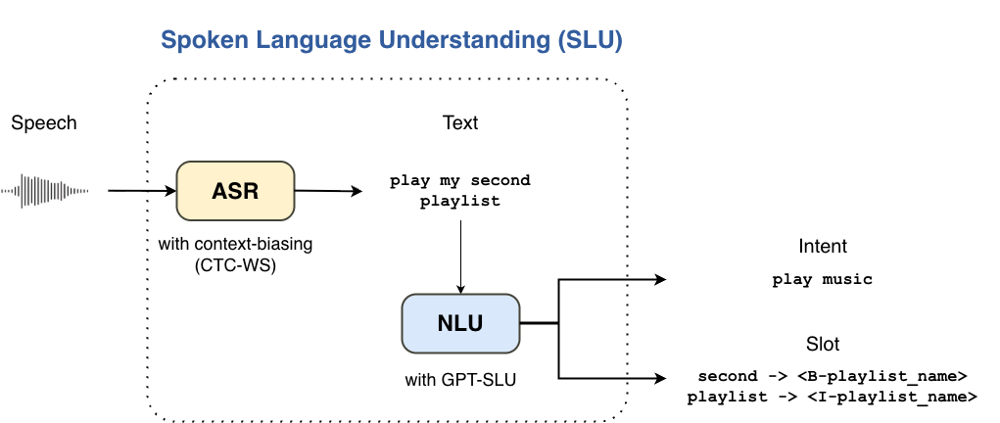
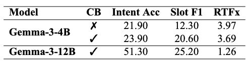

# SLU Pipeline
This repository contains the demo code implementation of our graduation project:  

 **Robust Real-Time Automatic Speech Recognition and Natural Language Understanding in Low-Resource Environments**. Po-Yen Chen, Kai-Chen Tsai.

This code will generate a temporary demo website by Gradio. You can use the website to understand how we do.

## Architecture
. 

## Results

- ASR: Use *parakeet-ctc-0.6b* model. 
- NLU: Use **2-stage GPT-SLU**
- Dataset: [SLURP](https://github.com/pswietojanski/slurp)

## Preperation
### CUDA
Our code can run on **CUDA 12.8**.

### Python Package
We use **uv** as package system. You can use this code to setup the environment.  

```sh
uv sync
```

### ASR model
Run this code to download the `stt_en_fastconformer_ctc_large`, the model we used in our code.
```sh
uv run load.py
```

### NLU model
You need pull these modle if you want to uses by Ollama.
```sh
ollama pull gemma3:4b
ollama pull gemma3:12b
ollama pull gpt-oss:20b
```
We will use ollama to access these model. Make sure you can use ollama properly.

## Usage
Use this command to build the website by Gradio.
```
uv main.py
```
Then you will get the links of website.

## License
```
Copyright (c) 2025 Po-Yen Chen and Kai-Chen Tsai
All rights reserved.

This source code is not licensed for redistribution or use.
```